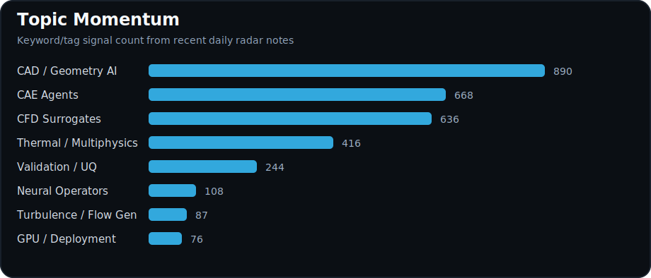
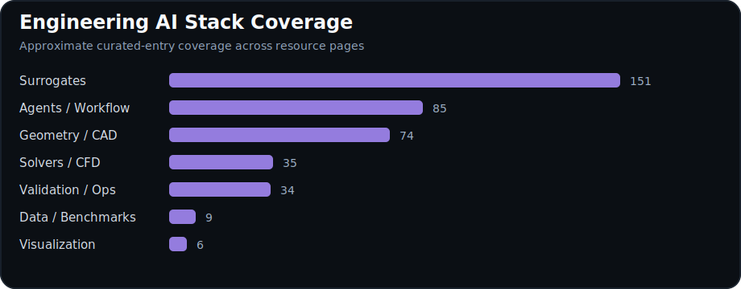
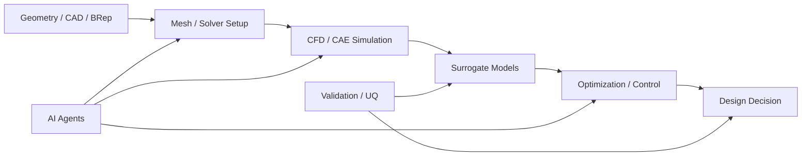

# 🌊 Awesome_VA

### **CFD-AI · Scientific Machine Learning · Engineering Research Agents** 큐레이션

*CFD-AI, SciML, differentiable solver, neural operator, turbulence modeling, AI-assisted graduate research workflow를 위한 선별형 resource map.*

---

## ✨ Highlights

- **CFD-AI & SciML:** differentiable CFD, JAX/Python PDE solver, AMR, neural operator, turbulence surrogate model.
- **Engineering AI workflows:** OpenFOAM automation, CAD/geometry AI, visualization, ParaView/PyVista, agentic research tooling.
- **Research productivity:** literature review, paper writing, experiment automation, local AI workflow, lab-scale AI adoption.
- **Research intelligence:** daily radar, weekly synthesis, best anchor, technical theme, experiment candidate를 연결한다.

---

## 📡 Live Field Dashboard

> `daily/`와 `resources/`를 파싱해 생성한 정적 SVG dashboard입니다. README는 GitHub-safe하게 유지하고, 자동화는 `scripts/build_trend_charts.py`와 `.github/workflows/update-trends.yml`에 둡니다.

---

## 🧭 Engineering AI Stack

---

## 🛰️ Intelligence layers

| Layer | 먼저 볼 문서 | 목적 |
|---|---|---|
| 🗓️ **Daily radar** | [daily/](daily/) | 매일 sciML / Engineering AI 신호를 짧게 수집 |
| 📆 **Weekly synthesis** | [weekly/](weekly/) | daily 신호를 연구 thesis와 글감으로 압축 |
| ⭐ **Best anchors** | [best/](best/) | 반복해서 기준점이 되는 사람/논문 lineage |
| 🧵 **Themes** | [themes/](themes/) | 반복 등장하는 장기 기술 흐름 |
| 🧪 **Experiments** | [experiments/](experiments/) | VA가 직접 테스트할 benchmark/구현 아이디어 |
| 🔎 **Sources** | [sources.md](sources.md) | radar용 검색 query와 선별 규칙 |

---

## 🔬 Research areas

| 영역 | 먼저 볼 문서 | 포함 내용 |
|---|---|---|
| 📚 **CFD-AI papers & surveys** | [CFD-AI papers & surveys](resources/cfd-ai-papers-surveys.md) | Survey paper, literature map, review resource, curated paper collection |
| 🧪 **Differentiable & Python PDE Solvers** | [Differentiable & Python PDE Solvers](resources/differentiable-python-pde-solvers.md) | JAX/Python solver, differentiable CFD, AMR, inverse/design workflow |
| 🧠 **Neural operators & tensor methods** | [Neural operators & tensor methods](resources/neural-operators-tensor-methods.md) | FNO, operator learning, tensor method, QTT, spectral/operator architecture |
| 🌪️ **Turbulence & generative flow models** | [Turbulence & generative flow models](resources/turbulence-generative-flow-models.md) | Turbulence surrogate, super-resolution, rollout prediction, generative physical fields |
| 🔥 **Thermal & heat transfer** | [Thermal & heat transfer](resources/thermal-heat-transfer.md) | Heat-transfer modeling, thermal property, thermal-fluid validation workflow |
| 📊 **Datasets & benchmarks** | [Datasets & benchmarks](resources/datasets-benchmarks.md) | Flow dataset, benchmark suite, metric, reproducibility reference |

---

## 🧰 Engineering workflow tools

| 영역 | 먼저 볼 문서 | 포함 내용 |
|---|---|---|
| 🌊 **OpenFOAM & CFD automation** | [OpenFOAM AI workflows](resources/openfoam-ai-workflows.md) · [OpenFOAM tips](resources/openfoam-tips.md) | Case setup, solver automation, post-processing, safety check |
| 🧩 **CAD, meshing & geometry AI** | [CAD & geometry AI](resources/cad-geometry-ai.md) · [Meshing & GPU workflows](resources/meshing-gpu-workflows.md) | FreeCAD, ForgeCAD, geometry agent, SDF/voxel workflow, mesh tooling |
| 🚀 **GPU / HPC CFD** | [GPU OpenFOAM & HPC](resources/gpu-openfoam-hpc.md) | GPU acceleration, HPC workflow, scalable simulation tooling |
| 🎞️ **Visualization & post-processing** | [Visualization & post-processing](resources/visualization-postprocessing.md) | ParaView, PyVista, VTK, scientific visualization, visual debugging |
| 🌦️ **Weather & climate visualization** | [Weather/climate visualization](resources/weather-climate-visualization.md) | Earth-system tool, climate/atmospheric visualization, large-field analysis |

---

## 🤖 Agent & workflow tools

| 영역 | 먼저 볼 문서 | 포함 내용 |
|---|---|---|
| 🧑‍🔬 **Research automation & writing** | [Research automation & writing](resources/research-automation-writing.md) | Literature review, experiment automation, coding agent, research workflow |
| ✍️ **Paper writing tools** | [Paper writing tools](resources/paper-writing-tools.md) | LaTeX, citation, review, figure, proposal, writing workflow |
| 🛠️ **Agent tools** | [Agent tools & workflow](resources/agent-tools-workflow.md) | Claude/Codex/OpenCode, MCP tools, local harnesses, automation bridges |
| 💻 **Local AI workflow** | [Local AI workflow](resources/local-ai-workflow.md) | Ollama, llama.cpp, local LLM, offline/low-cost research workflow |
| 🏫 **Lab AI adoption** | [AI coding & lab adoption](resources/ai-coding-lab-adoption.md) | Team AI tooling, lab workflow, coding support programs |

---

## 🧭 Research practice

| 영역 | 먼저 볼 문서 | 포함 내용 |
|---|---|---|
| ∑ **Math foundations** | [Mathematical foundations](resources/math-foundations.md) | Function representation, numerical intuition, theoretical notes |
| 📈 **Optimization for SciML** | [Optimization for SciML](resources/optimization-sciml.md) | Training dynamics, optimization methods, architecture comparison |
| 🎓 **Fluid/AI education** | [Fluid mechanics, turbulence & AI education](resources/education-fluid-ai.md) | Lectures, educational repositories, turbulence/ML learning resources |
| 🗂️ **Presentation workflow** | [Research presentation & report workflow](resources/research-presentation-workflow.md) | Research story structure, reports, talks, visual communication |
| 📌 **Events & opportunities** | [Events & opportunities](resources/events-opportunities.md) | Conferences, industry signals, graduate/career opportunities |
| 🗓️ **Daily radar** | [daily/](daily/) | Periodic research updates and short synthesis notes |

---

## 🚀 How to use this repository

- 위 표에서 관심 있는 영역을 고르고 관련 `resources/*.md`로 이동한다.
- 각 entry는 ranking이 아니라 연구 노트로 읽는다.
- 실험 설계, 문헌 조사, 논문 아이디어, workflow 자동화의 출발점으로 사용한다.
- 자세한 관리 규칙은 [CURATION.md](CURATION.md)에 둔다.

---

**VortexyAether**를 위해 **VA_TARS**가 건조한 engineering judgment로 관리합니다.

